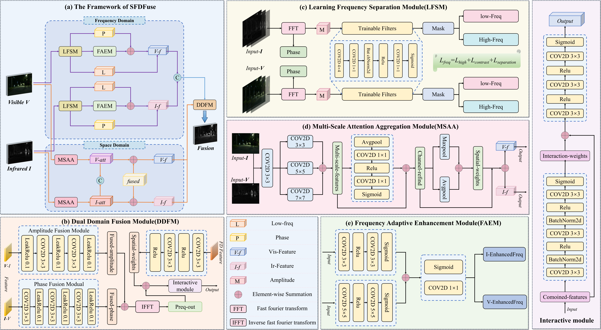
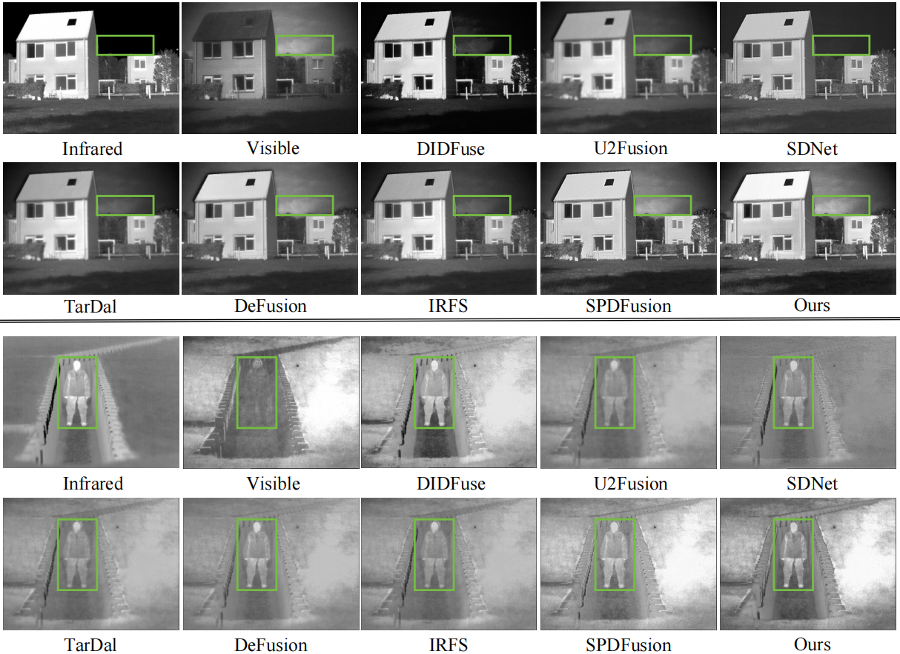
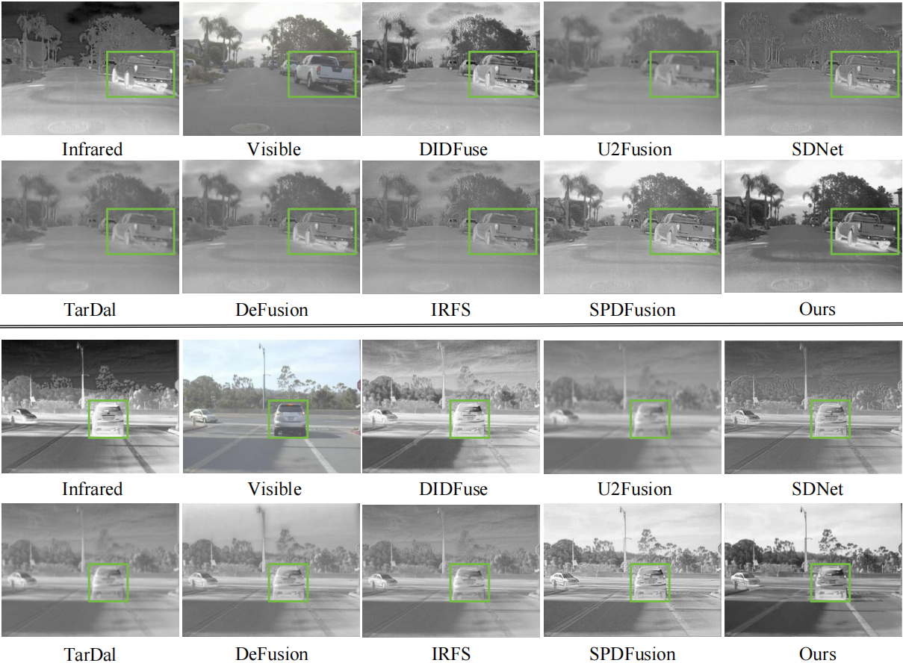

# SFDFuse: A Lightweight and Efficient Spatial-Frequency Fusion Approach for Infrared and Visible Image Integration

## Abstract
With the rise of multimodal perception in applications such as monitoring, detection, and autonomous driving, infrared and visible image fusion has gained increasing attention for enhancing information representation and environmental awareness. Infrared images highlight targets in low-light conditions, while visible images provide rich texture details. However, due to the significant differences in
their imaging mechanisms, achieving a balance among structural integrity, detail clarity, and realtime performance remains a major challenge. In view of the problem that existing methods are difficult to balance between structure preservation, detail restoration and computational overhead, this paper proposes a lightweight and efficient dual-domain collaborative fusion framework SFDFuse. This method combines the advantages of spatial domain and frequency domain modeling, improves modal consistency through the intensity-structure interaction mechanism, introduces learning-based frequency separation and adaptive enhancement modules to extract and enhance multi-scale detail information, and integrates global structure and local texture through a dynamic fusion strategy. Experimental results on multiple public datasets show that SFDFuse is superior to current mainstream. methods in terms of structural restoration, detail clarity and fusion quality, and has extremely low
computational cost and excellent real-time performance. It is suitable for multimodal image fusion tasks in edge computing and resource-constrained scenarios

### ⚙ Network Architecture

Our SFDFuse is implemented in ``net.py``.

### 🏊 Training
**1. Virtual Environment**
```
- Python 3.7+
- PyTorch 1.8.1
- CUDA 11.1 (for GPU support)

### Dependencies

```bash
torch==1.8.1+cu111
torchvision==0.9.1+cu111
torchaudio==0.8.1
numpy==1.21.5
opencv-python==4.5.3.56
scikit-learn==1.1.3
scikit-image==0.19.2
scipy==1.7.3
kornia==0.2.0
matplotlib==3.7.5
tqdm==4.66.4
```

**2. Data Preparation**

Download the MSRS dataset from [this link](https://github.com/Linfeng-Tang/MSRS) and place it in the folder ``'./MSRS_train/'``.

**3. CDDFuse Training**

Run 
1. Stage 1 Training:
```bash
python train_stage1.py --data_path /path/to/training/data
```

2. Stage 2 Training:
```bash
python train_stage2.py --data_path /path/to/training/data
```

### 🏄 Testing

**1. Pretrained models**

Pretrained models are available in ``'./models/stage1_best_model.pth'`` and ``'./models/best_model.pth'``, which are responsible for the Infrared-Visible Fusion 

**2. Test datasets**

The test datasets used in the paper have been stored in ``'./test_img/RoadScene'``, ``'./test_img/TNO'`` for IVF

Since the size of **MSRS dataset** for IVF is 500+MB, we can not upload it for exhibition. It can be downloaded via [this link](https://github.com/Linfeng-Tang/MSRS). The other datasets contain all the test images.

**3. Results in Our Paper**

If you want to infer with our SFDFuse and obtain the fusion results in our paper, please run 
```
python test_IVF.py
``` 
for Infrared-Visible Fusion 

The testing results will be printed in the terminal. 

The output for ``'test_IVF.py'`` is:

```
==============================================================
The test result of TNO :
                 EN      SD      SF      MI     VIF     Qabf   
CDDFuse         7.10    45.36   11.94   3.11    0.91    0.57   
==============================================================

==============================================================
The test result of RoadScene :
                 EN      SD      SF      MI     VIF     Qabf   
CDDFuse         7.38    55.68   14.79   3.25    0.84    0.54    
==============================================================
```
which can match the results in Table 2,3 in our original paper.

## 🙌 SFDFuse

### Illustration of our Frame model.

<div align="center">
    
</div>

### Qualitative fusion results.

#### TNO Dataset Results
<div align="center">
    
</div>

#### Road Scene Results
<div align="center">
    
</div>

